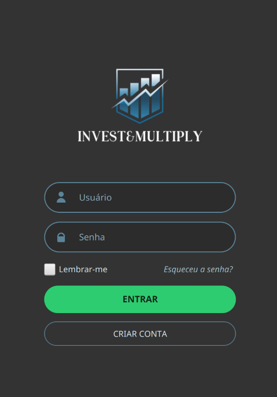

# 📈 Invest&Multiply

<p align="center">
  
  
  
  
</p>

O **Invest&Multiply** é um gerenciador de carteira de investimentos pessoal desenvolvido em Java.

---

## 📸 Demonstração da Interface

> ADICIONAR ALGUMAS CAPTURAS DE TELAS

<p align="center">
  
</p>

---

## ✨ Funcionalidades Principais

* **Autenticação Segura:** Cadastro e login de usuários com criptografia/validação simples e carregamento de sessões individuais.
* **Gestão de Ativos Multiclasse:** Suporte integrado a Ações, FIIs (Fundos Imobiliários), Criptomoedas, Títulos de Renda Fixa e Fundos de Investimento.
* **Cotações em Tempo Real (Scraping & APIs):**
    * **Ações e FIIs:** Atualização de preços via Web Scraping (com Jsoup) diretamente do site *Fundamentus*.
    * **Criptomoedas:** Captura de dados de mercado do *CoinMarketCap*.
    * **Renda Fixa:** Integração com a API oficial do *Banco Central* para puxar as taxas atualizadas de IPCA e SELIC.
* **Relatórios Analíticos:** Geração de relatórios de desempenho geral e distribuição de ativos por categoria.
* **Persistência Customizada:** Salvamento automático do progresso do usuário e histórico de carteira no formato JSON.

---

## 🛠️ Arquitetura Principal

```text
invest-multiply/
├── app/
│   ├── data/                   # JSONs de dados dos usuários (gerados em execução)
│   ├── src/main/java/projeto/      
│   │   ├── gui/                # Interfaces Gráficas JavaFX (Views e Controllers FXML)
│   │   ├── sistemas/           # Gerenciamento centralizado (Classe Carteira)
│   │   ├── investimentos/      # Modelos de Ativos (FinancialAsset e subclasses)
│   │   ├── servicos/           # Regras de Negócio (UserController, ReportService)
│   │   ├── relatorios/         # Lógica e exportação de relatórios
│   │   ├── repositorios/       # Manipulação e gravação física de dados
│   │   ├── persistencia/       # Fábricas de desserialização (Gson)
│   │   ├── usuario/            # Classes de modelo de Usuário e Históricos
│   │   ├── interfaces/         # Contratos do sistema (Persistivel, Calculavel)
│   │   └── excecoes/           # Exceções personalizadas do domínio financeiro
│   └── build.gradle            # Script de construção do Gradle
```

## Pacotes e responsabilidades

### `projeto.interfaces`

- `Persistivel` - contrato para salvar e carregar objetos.
- `Calculavel` - contrato para ativos que expõem variação e rentabilidade.
- `Alertavel` - interface auxiliar de alerta usada na UI.

### `projeto.excecoes`

- `InvalidAssetException` - falha de validação de ativo.
- `PersistenceException` - falha ao salvar/carregar dados.

### `projeto.usuario`

- `Usuario` - representa usuário do sistema.
- Armazena nome, senha, carteira e histórico mensal de desempenho.
- Registra snapshots mensais do valor investido e do valor de mercado.

### `projeto.repositorios`

- `UserRepository` - salva/recupera usuários em `data/usuario_<nome>.json`.
- Trata criação do diretório `data/` e encapsula acesso ao JSON.

### `projeto.persistencia`

- `GsonFactory` - cria uma instância do Gson com desserializador customizado.
- Reconstrói a subclasse correta de `FinancialAsset` ao ler JSON.

### `projeto.sistemas`

- `Carteira` - núcleo do sistema de investimentos.
- Gerencia a lista de ativos, compra, edição, remoção e atualização de preços.
- Agrupa ativos por tipo, calcula totais, variações e rentabilidade.
- Implementa `Persistivel` para salvar/carregar a carteira no arquivo `carteira.json`.

### `projeto.investimentos`

- `FinancialAsset` - classe base para ativos financeiros, com dados comuns e operações.
- `Ação`, `Fii`, `Criptomoeda`, `TituloRendaFixa`, `FundoDeInvestimento` - tipos específicos de ativos.
- Cada ativo fornece métodos para atualizar informações, calcular rendimento e gerar resumo.

### `projeto.servicos`

- `UserController` - gerencia login, cadastro e salvamento do usuário atual.
- `ReportService` - cria relatórios a partir da carteira.

### `projeto.relatorios`

- `Report` - classe base para relatórios, define geração de texto e exportação.
- `RelatorioGeral` - calcula e formata indicadores agregados da carteira.
- `RelatorioPorTipo` - agrupa ativos por tipo e calcula valores por grupo.

### `projeto.gui`

- `MainApp` - inicializa a aplicação JavaFX e controla troca de telas.
- `TelaLogin` - tela de login/cadastro de usuário.
- `TelaCarteira` - tela principal da carteira, com cadastro, edição, remoção, relatórios e dashboard.
- `Recursos` - centraliza carregamento de imagens, ícones e tema CSS.

## Funcionamento do fluxo

1. O usuário abre a aplicação em `MainApp`.
2. A tela de login (`TelaLogin`) solicita usuário e senha.
3. `UserController` carrega o usuário ou cria novo cadastro via `UserRepository`.
4. Depois de logado, `TelaCarteira` exibe ativos e permite operações.
5. `Carteira` mantém os ativos em memória e calcula métricas financeiras.
6. `ReportService` cria relatórios que podem ser exibidos ou exportados.
7. Dados do usuário são persistidos em JSON para reuso.

## Persistência e dados

- Usuários são persistidos em arquivos JSON dentro de `data/`.
- A carteira também pode ser salva em `carteira.json` pelo próprio objeto `Carteira`.
- `GsonFactory` garante desserialização correta de subclasses de `FinancialAsset`.

## Integrações externas

- `Ação` e `Fii` usam scraping via Jsoup no site Fundamentus para obter cotações.
- `Criptomoeda` usa scraping no CoinMarketCap.
- `TituloRendaFixa` consulta a API do Banco Central para IPCA e SELIC.
- Essas integrações dependem de formatos externos e podem romper se os sites mudarem.

## Como executar

Usando Gradle no diretório raiz:

```bash
git clone https://github.com/JoaoMarcosFlausinoDeLima/projeto-mc302.git
cd invest-multiply
./gradlew build
./gradlew run
```


## Arquivos de dados

- `app/carteira.json` - arquivo de persistência local da carteira.
- `app/data/usuario_*.json` - arquivos de usuário persistidos pelo `UserRepository`.

## Lista de arquivos principais

- `app/src/main/java/projeto/App.java`
- `app/src/main/java/projeto/gui/MainApp.java`
- `app/src/main/java/projeto/gui/TelaLogin.java`
- `app/src/main/java/projeto/gui/TelaCarteira.java`
- `app/src/main/java/projeto/sistemas/Carteira.java`
- `app/src/main/java/projeto/investimentos/FinancialAsset.java`
- `app/src/main/java/projeto/investimentos/Ação.java`
- `app/src/main/java/projeto/investimentos/Fii.java`
- `app/src/main/java/projeto/investimentos/Criptomoeda.java`
- `app/src/main/java/projeto/investimentos/TituloRendaFixa.java`
- `app/src/main/java/projeto/investimentos/FundoDeInvestimento.java`
- `app/src/main/java/projeto/servicos/UserController.java`
- `app/src/main/java/projeto/servicos/ReportService.java`
- `app/src/main/java/projeto/relatorios/Report.java`
- `app/src/main/java/projeto/relatorios/RelatorioGeral.java`
- `app/src/main/java/projeto/relatorios/RelatorioPorTipo.java`
- `app/src/main/java/projeto/repositorios/UserRepository.java`
- `app/src/main/java/projeto/persistencia/GsonFactory.java`
- `app/src/main/java/projeto/usuario/Usuario.java`
- `app/src/main/java/projeto/interfaces/Persistivel.java`
- `app/src/main/java/projeto/interfaces/Calculavel.java`
- `app/src/main/java/projeto/excecoes/InvalidAssetException.java`
- `app/src/main/java/projeto/excecoes/PersistenceException.java`

## 👥 Desenvolvedores
- João Marcos Flausino De Lima
- João Victor de Almeida Moura
- Denise Tuda
